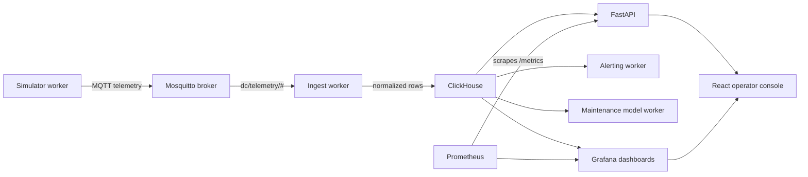

# Architecture Overview

DataCenterDigitalTwin models a small 2N data center supervisory-control environment. It is intentionally compact, but the service boundaries mirror a production monitoring stack: telemetry generation, message transport, ingestion, storage, API access, alerting, dashboards, and an operator console.

## System Context

## Runtime Services

| Service | Role | Source |
| --- | --- | --- |
| `simulator` | Emits normal and scenario-driven telemetry for racks, HVAC, UPS, and PDU assets. | `apps/api/app/simulator.py` |
| `mqtt` | Carries simulator telemetry on `dc/telemetry/#`. | `deploy/mosquitto/mosquitto.conf` |
| `ingest` | Subscribes to MQTT, enriches payloads, and batches inserts into ClickHouse. | `apps/api/app/ingest.py` |
| `clickhouse` | Stores raw telemetry, alert events, alert actions, and maintenance scores. | `deploy/clickhouse/sql/` |
| `api` | Exposes health, telemetry, alert, scenario, and metrics endpoints. | `apps/api/app/api.py` |
| `alerting` | Evaluates recent telemetry and writes alert events/actions. | `apps/api/app/alerting.py` |
| `maintenance-model` | Scores recent telemetry windows for maintenance risk. | `apps/api/app/maintenance_model.py` |
| `prometheus` | Scrapes FastAPI metrics for API observability. | `deploy/prometheus/prometheus.yml` |
| `grafana` | Provisions dashboards over ClickHouse and Prometheus. | `deploy/grafana/` |
| `frontend` | Serves the React operator console from nginx. | `apps/operator-console/` |

## Data Flow

1. The simulator chooses a normal profile or a temporary scenario profile.
2. It publishes metric payloads to Mosquitto topics such as `dc/telemetry/rack/rack-a01`.
3. The ingest worker parses each payload, adds site, zone, asset class, severity, and alarm text, then writes batched rows into `dc_twin.telemetry_raw`.
4. FastAPI reads ClickHouse for summary, recent telemetry, active alarms, and alert lifecycle views.
5. The alerting worker evaluates ClickHouse queries on a schedule and writes alert events/actions.
6. The maintenance worker builds metric baselines from recent telemetry and writes risk scores.
7. Grafana reads ClickHouse and Prometheus for dashboards.
8. The React console calls FastAPI for workflow actions and embeds selected Grafana panels for trend context.

## State Boundaries

- Source-controlled state: app code, SQL schema, Grafana dashboards, Prometheus config, Mosquitto config, examples, and docs.
- Runtime state: Docker volumes for ClickHouse, Grafana, and simulator control state.
- Local-only state: `.env` files, `node_modules`, frontend build output, Python caches, and generated package artifacts.

## Scenario Control

The API and simulator share `SIMULATOR_CONTROL_PATH` through a Docker volume. Scenario endpoints write a short-lived control document, and the simulator reads it on each publish loop. This keeps scenario control simple while the app still runs as separate containers.

Current scenarios:

- `power_outage`
- `cooling_degradation`
- `load_transfer`

## Observability

- FastAPI exposes Prometheus metrics at `/metrics`.
- Prometheus scrapes the API service inside the Compose network.
- Grafana provisions both ClickHouse and Prometheus datasources.
- Grafana dashboards are checked in as JSON so dashboard changes can be reviewed.

## Known Phase 1 Limits

- Compose is the only deployment target.
- Database initialization is file-based rather than migration-tool based.
- The maintenance model is a baseline scoring workflow, not production ML serving.
- Authentication and multi-user authorization are intentionally out of scope.
- CI validates build and configuration, but it does not deploy images or run the full Compose stack.
