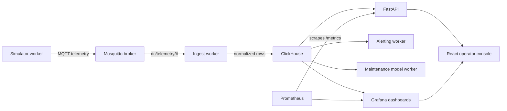

# Architecture Overview

DataCenterDigitalTwin models a small 2N data center supervisory-control environment. It is intentionally compact, but the service boundaries mirror a production monitoring stack: telemetry generation, message transport, ingestion, storage, API access, alerting, dashboards, and an operator console.

For a visual version of this map with platform icons, open `docs/architecture-map.html` in a browser.

## Current System Context



## Target Hybrid Telemetry and Event Architecture

Phase 2 introduces two persistence paths with different responsibilities:

- **ClickHouse** is the analytical system of record for high-volume numeric telemetry, derived features, rollups, and time-window queries.
- **PostgreSQL event store** is the initial append-only system of record for lower-volume operational facts such as state changes, commands, alerts, maintenance actions, scenario transitions, and model inferences.
- **MQTT** remains the device-facing transport for simulated equipment telemetry.
- **NATS JetStream** is a later option for durable internal event delivery, consumer replay, retries, and decoupled projectors. The broker is not the authoritative event history.

```mermaid
flowchart LR
    Simulator["Simulator and equipment models"] -->|high-volume MQTT telemetry| Mosquitto["Mosquitto"]
    Mosquitto --> Ingest["Telemetry ingest worker"]
    Ingest -->|raw and normalized process values| ClickHouse["ClickHouse telemetry store"]

    ClickHouse --> Detectors["Stateful detectors and feature workers"]
    ClickHouse --> Maintenance["Maintenance model worker"]

    API["FastAPI and operator actions"] --> EventWriter["Event writer abstraction"]
    Alerting["Alerting worker"] --> EventWriter
    Detectors -->|anomalies and state transitions| EventWriter
    Maintenance -->|risk scores and recommendations| EventWriter
    Simulator -->|scenario and equipment transitions| EventWriter

    EventWriter --> EventStore["PostgreSQL append-only event store"]
    EventStore --> Projectors["Idempotent projectors"]
    Projectors --> Timeline["Asset timeline read model"]
    Projectors --> AlertViews["Alert lifecycle read model"]
    Projectors --> MaintenanceViews["Maintenance history read model"]

    ClickHouse --> Grafana["Grafana dashboards"]
    Timeline --> API
    AlertViews --> API
    MaintenanceViews --> API
    ClickHouse --> API
    API --> Console["React operator console"]
    Grafana --> Console

    EventWriter -. later transactional outbox .-> JetStream["NATS JetStream"]
    JetStream -. durable delivery .-> Projectors
```



The same real-world occurrence can be represented in both stores at different levels of abstraction. For example, a pump temperature trend remains a dense ClickHouse time series, while `ThresholdExceeded`, `AnomalyDetected`, `MaintenanceRecommended`, and `MaintenanceCompleted` are durable events. Shared identifiers connect an event to the telemetry window that explains it.

## Runtime Services

| Service | Role | Source |
| --- | --- | --- |
| `simulator` | Emits normal and scenario-driven telemetry for racks, HVAC, UPS, and PDU assets. | `apps/api/app/simulator.py` |
| `mqtt` | Carries simulator telemetry on `dc/telemetry/#`. | `deploy/mosquitto/mosquitto.conf` |
| `ingest` | Subscribes to MQTT, enriches payloads, and batches inserts into ClickHouse. | `apps/api/app/ingest.py` |
| `clickhouse` | Stores raw telemetry, analytical rollups, derived features, and maintenance scoring inputs. | `deploy/clickhouse/sql/` |
| `event-store` | Phase 2 PostgreSQL service containing append-only domain-event streams and projector checkpoints. | Planned |
| `event-writer` | Shared application abstraction for validating and appending canonical domain events. | Planned |
| `event-projector` | Builds asset timeline, alert lifecycle, and maintenance read models from durable events. | Planned |
| `api` | Exposes health, telemetry, alert, scenario, event timeline, maintenance, and metrics endpoints. | `apps/api/app/api.py` |
| `alerting` | Evaluates recent telemetry, manages alert policy, and emits alert lifecycle events. | `apps/api/app/alerting.py` |
| `maintenance-model` | Builds telemetry features, scores asset risk, and emits versioned inference and recommendation events. | `apps/api/app/maintenance_model.py` |
| `prometheus` | Scrapes FastAPI metrics for API observability. | `deploy/prometheus/prometheus.yml` |
| `grafana` | Provisions dashboards over ClickHouse and Prometheus. | `deploy/grafana/` |
| `frontend` | Serves the React operator console from nginx. | `apps/operator-console/` |

## Data Flow

### Current Telemetry Flow

1. The simulator chooses a normal profile or a temporary scenario profile.
2. It publishes metric payloads to Mosquitto topics such as `dc/telemetry/rack/rack-a01`.
3. The ingest worker parses each payload, adds site, zone, asset class, severity, and alarm text, then writes batched rows into `dc_twin.telemetry_raw`.
4. FastAPI reads ClickHouse for summary, recent telemetry, active alarms, and alert lifecycle views.
5. The alerting worker evaluates ClickHouse queries on a schedule and writes alert events/actions.
6. The maintenance worker builds metric baselines from recent telemetry and writes risk scores.
7. Grafana reads ClickHouse and Prometheus for dashboards.
8. The React console calls FastAPI for workflow actions and embeds selected Grafana panels for trend context.

### Phase 2 Hybrid Flow

1. Raw process values continue through MQTT and are batch-written to ClickHouse.
2. Scenario control, operator actions, alerting, equipment state transitions, anomaly detectors, and maintenance models create canonical domain events.
3. The event writer appends those events to a PostgreSQL event stream using unique event IDs and stream-version constraints.
4. Events contain correlation and causation identifiers plus references to relevant ClickHouse telemetry windows.
5. Idempotent projectors consume ordered events and update query-optimized timeline, alert, and maintenance views.
6. FastAPI combines event projections with ClickHouse telemetry so an operator can move from a durable event to the process values that explain it.
7. Predictive-maintenance training joins ClickHouse feature windows with event-store labels such as maintenance actions, interventions, recoveries, and failures.
8. Later, a transactional outbox can publish committed events to NATS JetStream for durable asynchronous processing without making the broker the source of truth.

## Canonical Event Envelope

Every domain event should use a common envelope independent of the storage platform:

```json
{
  "event_id": "uuid",
  "event_type": "MaintenanceRiskScored",
  "event_version": 1,
  "stream_id": "pump:pump-12",
  "stream_version": 42,
  "asset_id": "pump-12",
  "asset_type": "pump",
  "occurred_at": "2026-07-10T14:31:12.123Z",
  "recorded_at": "2026-07-10T14:31:12.241Z",
  "correlation_id": "uuid",
  "causation_id": "uuid",
  "scenario_id": "cooling-degradation-001",
  "source": "maintenance-model",
  "payload": {},
  "metadata": {}
}
```

Event payloads are versioned. Existing events are never updated in place; readers either support prior versions or upcast them into the current in-memory representation.

## Storage Boundaries

### ClickHouse Owns

- Raw and normalized process telemetry
- Event-time analytical queries
- High-cardinality metric history
- Materialized rollups and retention tiers
- Predictive-maintenance feature windows
- Grafana trend data

### Event Store Owns

- Scenario lifecycle
- Equipment state changes
- Commands and operator actions
- Alert lifecycle
- Anomaly detections
- Model inferences and recommendations
- Maintenance interventions and outcomes
- Failure and recovery facts
- Correlation and causation history

### Read Models Own

- Asset timelines
- Current alert and acknowledgement state
- Maintenance history
- Recommendation workflow state
- Human-readable scenario narratives

Read models are disposable and rebuildable. ClickHouse telemetry and the append-only event store are durable records.

## State Boundaries

- Source-controlled state: app code, SQL schema, event schemas, Grafana dashboards, Prometheus config, Mosquitto config, examples, and docs.
- Runtime state: Docker volumes for ClickHouse, PostgreSQL event storage, projector checkpoints, Grafana, and simulator control state.
- Local-only state: `.env` files, `node_modules`, frontend build output, Python caches, and generated package artifacts.

## Scenario Control

The API and simulator share `SIMULATOR_CONTROL_PATH` through a Docker volume. Scenario endpoints write a short-lived control document, and the simulator reads it on each publish loop. This keeps scenario control simple while the app still runs as separate containers.

Current scenarios:

- `power_outage`
- `cooling_degradation`
- `load_transfer`

Phase 2 should emit events for scenario request, activation, derived equipment commands, state transitions, completion, cancellation, and recovery so the complete operational narrative can be replayed independently of the temporary control document.

## Observability

- FastAPI exposes Prometheus metrics at `/metrics`.
- Prometheus scrapes the API service inside the Compose network.
- Grafana provisions both ClickHouse and Prometheus datasources.
- Grafana dashboards are checked in as JSON so dashboard changes can be reviewed.
- Phase 2 should add event append latency, append failures, optimistic-concurrency conflicts, projector lag, projector retries, dead-letter counts, and telemetry-to-event detection metrics.

## Known Phase 1 Limits

- Compose is the only deployment target.
- Database initialization is file-based rather than migration-tool based.
- The maintenance model is a baseline scoring workflow, not production ML serving.
- Authentication and multi-user authorization are intentionally out of scope.
- CI validates build and configuration, but it does not deploy images or run the full Compose stack.
- ClickHouse currently stores operational records that will be separated into telemetry and event-specific persistence during Phase 2.
