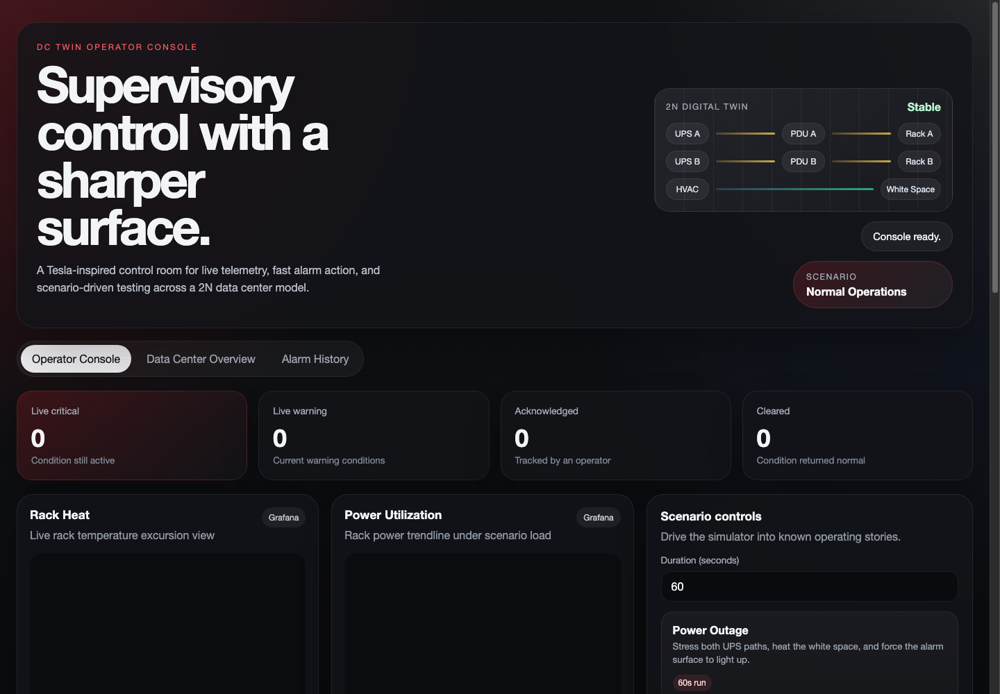
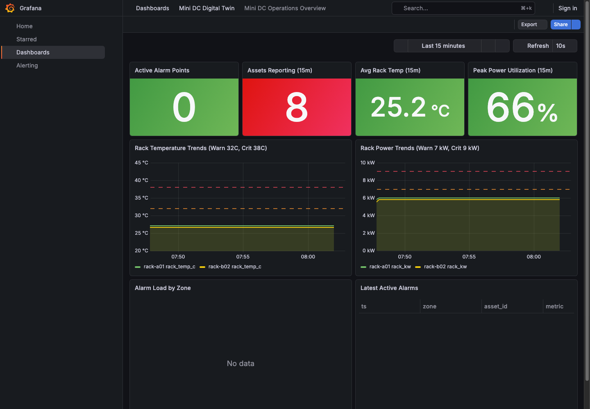

# Screenshots

Sample screenshots are captured from the local Docker Compose stack.

## Operator Console



The React operator console provides the main operator workflow: current alarm counters, embedded Grafana trend panels, scenario controls, and alert action surfaces.

## Grafana Operations Overview



The Grafana operations overview shows ClickHouse-backed telemetry panels and operational summary stat panels.

## Re-Capturing Screenshots

Start the stack first:

```bash
docker compose -f deploy/compose/docker-compose.yml --env-file deploy/compose/.env up -d --build
```

Then capture from a local browser or screenshot tool:

- Operator console: `http://localhost:5173`
- Grafana operations overview: `http://localhost:3000/d/dc-operations-overview/mini-dc-operations-overview?orgId=1&from=now-15m&to=now`

Keep screenshots under `docs/assets/screenshots/` and prefer names that describe the view.
